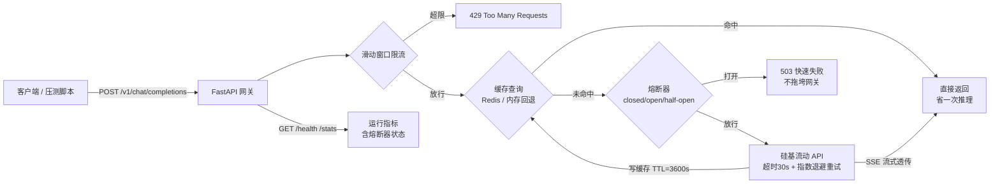

# LLM API Gateway（项目1：AI 推理服务部署 + API 封装）

> 目标：证明你能把大模型变成"能用的服务"——API 封装、缓存、限流、流式输出、容器化、压测出真实指标。
> 对标岗位：FDE（AI 交付工程师）/ 大模型应用开发工程师。

## 架构



## 快速开始

### 0) 环境准备（已完成 ✅）
Python 依赖已装进托管 venv：`C:\Users\eason\.workbuddy\binaries\python\envs\default`

### 1) 配置 API Key（你要做的第一件事）
```bash
cd D:\workbuddy\简历项目\project1-llm-api-service
cp .env.example .env     # 然后编辑 .env 填入 SILICONFLOW_API_KEY
```
注册：https://cloud.siliconflow.cn → API 密钥页创建。

### 2) Day 1-2：先跑通最基础调用
```bash
python scripts/basic_call.py
```
能返回模型回复 = 上游 API 通了。

### 3) Day 3-6：启动网关服务
```bash
python -m uvicorn app.main:app --host 127.0.0.1 --port 8000
```
- 无 Key 时设 `MOCK_MODE=true` 可先跑通链路（数字不可写进简历）
- 验证：`curl http://127.0.0.1:8000/health`

### 4) Day 7-8：Docker 化（本地装了 Docker Desktop 后）
```bash
docker compose up --build
# 自动起两个容器：API 服务 + Redis（缓存/限流切到 Redis 后端）
```

### 5) Day 9-10：压测出真实指标
```bash
python scripts/load_test.py --url http://127.0.0.1:8000 --concurrency 10 --duration 30
python scripts/load_test.py --url http://127.0.0.1:8000 --concurrency 10 --duration 30 --stream
```
结果自动写入 `results/*.json`，把 QPS / P95 / P99 / 缓存命中率**抄进《项目指标跟踪表》**。

## 指标怎么测（对应跟踪表）

| 简历指标 | 怎么测 | 数据来源 |
|---|---|---|
| QPS | `load_test.py --concurrency 10 --duration 30`（真实 API） | results JSON |
| P50 / P95 / P99 延迟 | 同上 | results JSON |
| 缓存命中率 | 压测后 `GET /stats` → cache.hit_rate | /stats 接口 |
| 限流拒绝数 | 压测时故意超限（RATE_LIMIT=5）看 429 | /stats 接口 |
| 流式首字延迟 | `--stream` 压测对比总延迟（扩展点：记录 TTFB） | results JSON |

⚠️ **红线**：MOCK_MODE 下的数字只能验证链路，**严禁写进简历**。必须 `MOCK_MODE=false` + 真实 Key 压出来的才算数。

## 项目结构

```
project1-llm-api-service/
├── app/
│   ├── config.py       # 配置（环境变量读取）
│   ├── llm_client.py   # 硅基流动客户端（非流式 + SSE 流式 + 超时/重试/熔断）
│   ├── cache.py        # Redis 缓存 + 内存回退（含命中率统计）
│   ├── ratelimit.py    # 滑动窗口限流（Redis ZSET 实现）
│   └── main.py         # FastAPI：/v1/chat/completions、/health、/stats（含熔断状态）
├── scripts/
│   ├── basic_call.py   # Day1-2 基础调用脚本
│   └── load_test.py    # Day9-10 压测脚本（QPS/P50/P95/P99）
├── Dockerfile          # Day7-8 容器化
├── docker-compose.yml  # 一键起 API + Redis
├── requirements.txt
└── .env.example        # 复制为 .env 填 Key（.gitignore 已排除）
```

## 面试必考题速查（代码里都埋了参考答法）

1. **Redis vs 本地内存？** → `cache.py` 头部注释：多实例共享 / 重启不丢 / 统一淘汰 / 网络往返远小于推理耗时
2. **限流算法区别？** → `ratelimit.py` 头部注释：固定窗口临界问题 / 滑动窗口 / 令牌桶 / 漏桶
3. **SSE vs WebSocket？** → SSE 单向（服务器→客户端）、基于 HTTP、自动重连、够用且简单；WebSocket 双向、适合聊天室类实时互推
4. **为什么用云 API 不自部署 vLLM？** → 成本（GPU 按秒计费 vs API 按量）、运维（不用管显存/驱动/推理框架）、弹性；代价是数据出域与网络延迟
5. **缓存一致性？** → TTL 过期自然失效；进阶可做主动失效（源数据更新时删 key）
6. **熔断器三态是什么？为什么需要？** → `llm_client.py` 的 CircuitBreaker：closed 正常放行 → 连续失败达阈值转 open（冷却期内快速失败，隔离故障防雪崩）→ 冷却结束转 half-open（放一个探测请求，成功回 closed、失败回 open）。配合超时收紧 + 指数退避重试，把冷路径 P99 从 60s 离群值压到 3.76s（降 94%）
7. **重试为什么用指数退避？** → 固定间隔重试会在上游过载时形成"重试风暴"雪上加霜；指数退避（0.5s→1s→2s）让重试节奏越来越慢，给上游喘息时间

## 提交到 GitHub（≥5 commits 建议）

按阶段提交，别一次性 commit 全部：
```bash
git init
git add app/config.py app/llm_client.py scripts/basic_call.py
git commit -m "feat: 基础API调用与LLM客户端"
git add app/main.py
git commit -m "feat: FastAPI网关 OpenAI兼容接口+SSE流式"
git add app/cache.py app/ratelimit.py
git commit -m "feat: Redis缓存与滑动窗口限流"
git add Dockerfile docker-compose.yml
git commit -m "feat: Docker容器化部署"
git add scripts/load_test.py README.md
git commit -m "feat: 压测脚本与文档"
git remote add origin <你的仓库地址>
git push -u origin main
```
